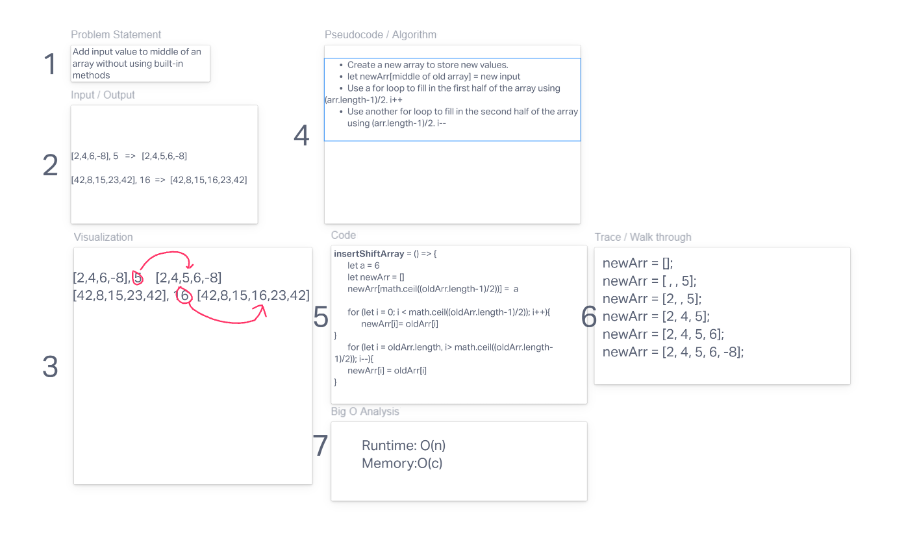

# Insert to Middle of an Array

Write a function called `insertShiftArray` which takes in an array and a value to be added. Without utilizing any of the built-in methods available to your language, return an array with the new value added at the middle index.

## Whiteboard Process

## Approach & Efficiency

We wanted to reacreate the splice method without actually using any other built in methods except for `array.prototype.length`.
