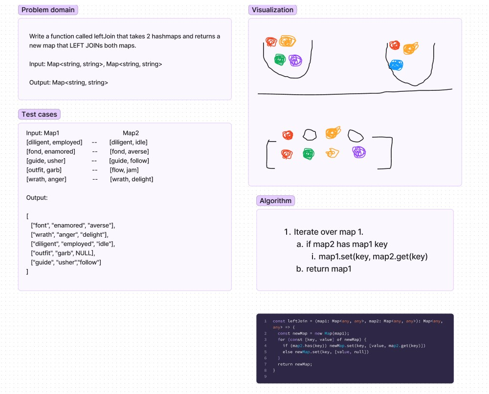

# Hashmap Left Join

## Challenge

- Write a function called left join

- Arguments: two hash maps

  - The first parameter is a hashmap that has word strings as keys, and a synonym of the key as values.

  - The second parameter is a hashmap that has word strings as keys, and antonyms of the key as values.

## Efficiency

- Time: O(n)

- Space: O(n)

## Solution

