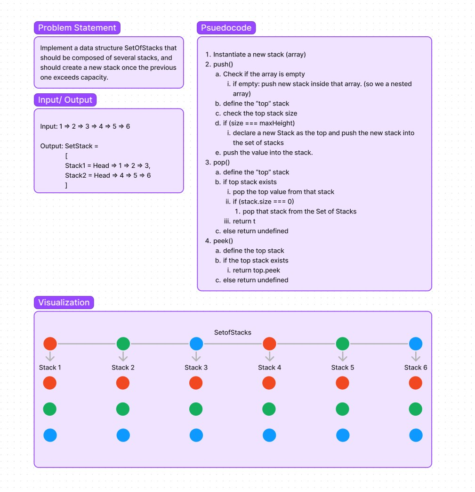

# Sets of Stacks

## Challenge

Implement a data structure SetOfStacks that should be composed of several stacks, and should create a new stack once the previous one exceeds capacity.  

## Approach & Efficiency

Test Driven Development. I started by writing code to get the intitial tests passing.

## Whiteboard

<!-- ## API -->

<!-- Description of each method publicly available to your Stack and Queue-->
