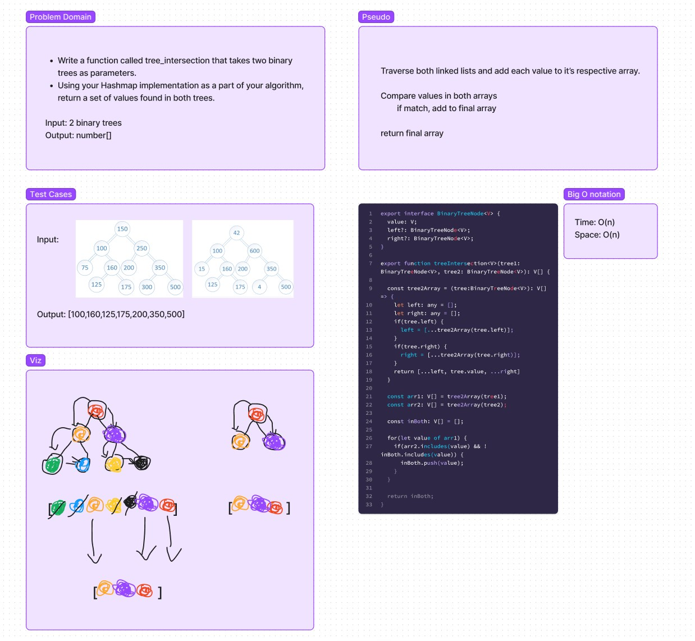

# Tree Intersection

## Challenge Summary

- Write a function called tree_intersection that takes two binary trees as parameters.

- Return a set of values found in both trees.

## Whiteboard

## Approach & Efficiency

Time: O(n^2)

Space: O(n)

## Solution

`npm test` to run test cases.
